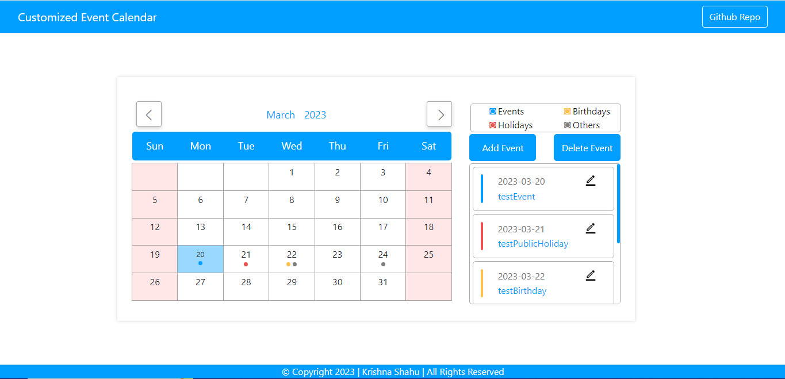
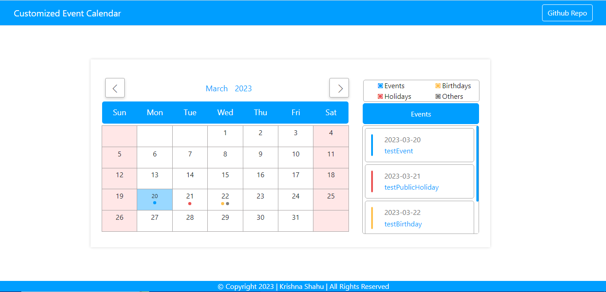

# Customized-Event-Calendar
Event Calendar for company use. This event calendar consist of two main views names Admin Calendar and User Calendar. 

# Building Stack : Django
<ul>
  <li>Frontend : HTML and CSS</li>
  <li>Backend  : Python (Django) </li>
  <li>DataBase : PostgresSQL </li>
</ul> 

# Admin Calendar 
  
  <u><h3>Features</h3></u>
<ul>
  <li>Custom Events based on categories.</li> 
  <li>Events Indication on both Calendar and Events tab.</li>
  <li>Pop-Up for Event Description by clicking the event name.</li>
  <li>Add/Delete/Edit Events.</li>
  <li><u>Events Visibility Options: </u>
    <ol>
      <li>Admin Only</li>
      <li>Both Admin and User</li>
    </ol>
  </li>
</ul> 

# User Calendar 
  
  <u><h3>Features</h3></u>
<ul>
  <li>Events Indication on both Calendar and Events tab.</li>
  <li>Pop-Up for Event Description by clicking the event name.</li>
</ul> 
